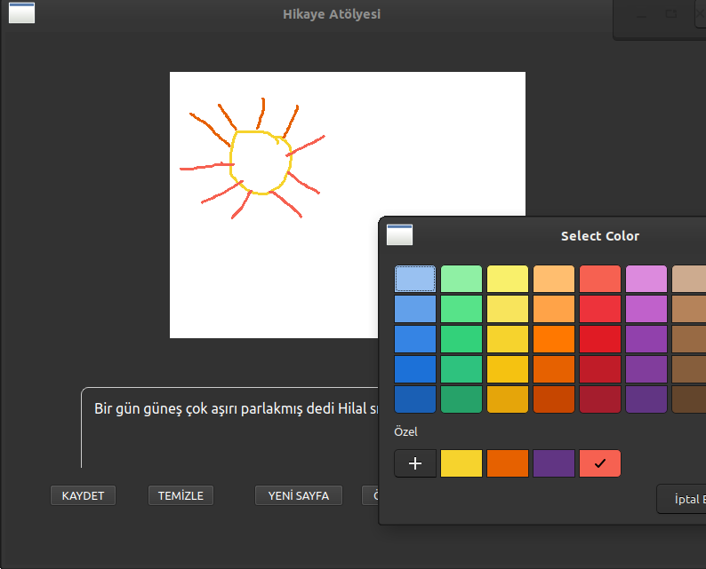

# Hikaye Atölyesi
Önerdiğimiz Pardus uygulaması, öğrencilerin hayal güçlerini kullanarak resimler ve metinler oluşturabilecekleri interaktif bir platform sunmaktadır. Bu sayede, öğrenciler aynı ekran üzerinde kendi hikayelerini yaratırken yaratıcı düşünme becerilerini de geliştirme fırsatı bulacaklardır. Uygulama, ilkokul seviyesindeki çocukların kolayca kullanabileceği bir ara yüze sahip olup, akıllı tahtalarla uyumlu şekilde çalışacaktır. Sonuç olarak, Pardus ortamında, eğitimde yenilikçi ve etkili bir araç sunarak öğretim süreçlerini daha eğlenceli ve etkileşimli hale getirecektir.

Hikaye Atölyesi, çizim yapabileceğiniz ve yazı yazabileceğiniz interaktif bir masaüstü uygulamasıdır. Kullanıcılar birden fazla sayfa oluşturabilir, her sayfaya özel çizimler ve metinler ekleyebilir ve bu sayfaları `.png` olarak kaydedebilir. Ek olarak, tüm sayfalardan otomatik bir video slayt gösterisi (MP4) de oluşturabilirsiniz.

## Özellikler

- 🖌️ Serbest çizim yapabilme
- 📝 Sayfaya not/öykü yazabilme
- 🗂️ Sayfa yönetimi (Yeni, Önceki, Sonraki)
- 🎨 Renk seçme aracı
- 💾 Sayfa kaydetme (PNG formatında)
- 🎬 Video slayt gösterisi oluşturma (MP4 formatında)

## Ekran Görüntüsü



## Kurulum

Python ortamınızı oluşturduktan sonra:

```bash
pip install -r requirements.txt
```

### Uygulamayı çalıştırmak için:

```bash
python main.py
```

## Gereksinimler

- Python 3.8+
- PySide6 (Qt tabanlı GUI)
- OpenCV (video işleme için)
- NumPy

## Proje Yapısı

```
.
├── main.py
├── modules/
│   ├── drawing_area.py
│   └── text_editor.py
├── ui/
│   └── main_window.py
│   └── main_window.ui
├── assets/
│   └── screenshot.jpeg
├── requirements.txt
├── README.md
└── .gitignore
```